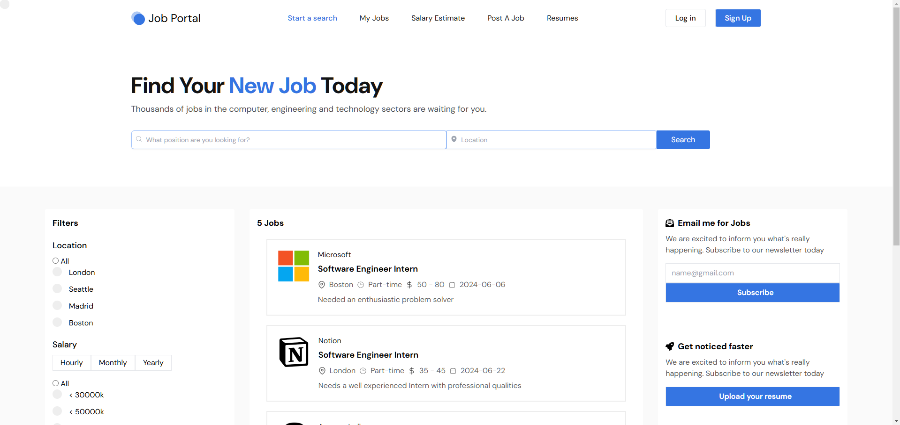

# Job Portal

## Overview

A job portal application built using the MERN stack (MongoDB, Express.js, React, Node.js). This application allows recruiters to create and manage the jobs, and for employers to post job listings.

## Table of Contents

- [Features](#features)
- [Technologies Used](#technologies-used)
- [Getting Started](#getting-started)
- [Running the Application](#running-the-application)
- [Scripts](#scripts)
- [Dependencies](#dependencies)
- [License](#license)

## Features

- User authentication and authorization
- Job posting and application
- Real-time notifications
- Responsive design

## Technologies Used

### Frontend

- React
- Vite
- Tailwind CSS
- Axios
- Firebase
- React Router DOM
- React Hook Form
- Styled Components
- SweetAlert2
- MDB React UI Kit

### Backend

- Node.js
- Express.js
- MongoDB
- Mongoose
- JWT for authentication
- Joi for validation
- Bcrypt for password hashing
- Dotenv for environment variables

## Getting Started

### Prerequisites

- Node.js (v14 or higher)
- MongoDB

### Installation

1. Clone the repository:

    ```bash
    git clone https://github.com/your-username/job-portal.git
    cd job-portal
    ```

2. Install dependencies for both client and server:

    ```bash
    # Install client dependencies
    cd client
    npm install

    # Install server dependencies
    cd ../server
    npm install
    ```

3. Create a `.env` file in the server directory and add the following:

    ```env
    MONGO_DB_USERNAME=your_mongo_db_connection_string
    MONGO_DB_API_KEY=your_API_secret
    ```

## Running the Application

### Development

1. Start the frontend development server:

    ```bash
    cd client
    npm run dev
    ```

2. Start the backend server:

    ```bash
    cd ../server
    npm start
    ```

## Scripts

### Client

- `npm run dev`: Starts the development server.
- `npm run build`: Builds the application for production.
- `npm run lint`: Lints the codebase.
- `npm run preview`: Previews the production build.

### Server

- `npm start`: Starts the server using nodemon.

## Dependencies

### Client

- **Production Dependencies**:
  - `axios`
  - `firebase`
  - `mdb-react-ui-kit`
  - `react`
  - `react-dom`
  - `react-hook-form`
  - `react-icons`
  - `react-router-dom`
  - `react-select`
  - `styled-components`
  - `sweetalert2`
- **Development Dependencies**:
  - `@types/react`
  - `@types/react-dom`
  - `@vitejs/plugin-react`
  - `autoprefixer`
  - `eslint`
  - `eslint-plugin-react`
  - `eslint-plugin-react-hooks`
  - `eslint-plugin-react-refresh`
  - `postcss`
  - `tailwindcss`
  - `vite`

### Server

- `bcrypt`
- `bcryptjs`
- `cors`
- `dotenv`
- `express`
- `joi`
- `joi-password-complexity`
- `jsonwebtoken`
- `mongodb`
- `mongoose`
- `nodemon`
- `react-toastify`

## License

This project is licensed under the ISC License.
